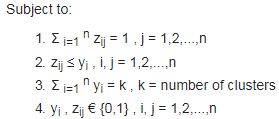

```{r setup, include=FALSE}
knitr::opts_chunk$set(echo = TRUE)
```

## Medoids

* these are representative objects whose average dissimilarity of all the objects in the cluster in minimal.
* they are always restricted to be **members** of the data set. 
* are most commonly used on data when a mean or centroid cannot be defined, such as graphs.
* for some datasets there may be more than one medoids.


more details [here](https://en.wikipedia.org/wiki/Medoid)


## PAM Algorithm
$$F(x) = minimize \sum_{i=1}^{n}\sum_{j=1}^{n}  d(i,j)  z_{i,j}$$ 



where,
 F(x) is the function to minimize, 
 d(i,j) is the dissimilarity measurement between the entities i and j,
 Z(ij - subscript) variable that ensures that only the dissimilarity between entities from the same cluster will be compiter in the main function,
 

###### Constraints
  1. ensures that every single entity is assigned to one cluster and only one cluster.
  2. ensures that the entity is assigned to its medoid that represent the cluster.
  3. ensures that there are exactly k clusters.
  4. lets the decision variables assume just the values of 0 and 1.

##### Build phase
  1. Choose k entities to become the medoids, or in case these entities were provided use them as the medoids,
  2. Calculate the dissimilarity matrix if it was not informed,
  3. Assign every entity to its closest medoid,
  
##### Swap phase 
  4. For each cluster search if any of the entities of the cluster lower the average dissimilarity coefficient, if it does select the entity that lowers this coefficient the most as the medoid for this cluster;
  5. If at least one medoid has changed go to (3), else end the algorithm.

##### Formulation
  Given a finite number of users, whose demands for some service are known and must be satisfied, and given a finite set of possible locations among which k must be chosen for the location of service centers, select the locations in such a way as to minimize the total distance travelled by users[2].


#### Acceptable Inputs 
  1. matrix representing every entity and the values of its variables.
  2. dissimilarity matrix - here we can provide dissimilarity directly as an i/p to the algorithm, instead of data matrix containing the entitites.


### Data Input: sample data
```{r, echo=FALSE}
options(rgl.useNULL = TRUE)
suppressPackageStartupMessages(library("tidyverse"))
suppressPackageStartupMessages(library("data.table"))
suppressPackageStartupMessages(library("readxl"))
suppressPackageStartupMessages(library("TSclust"))
suppressPackageStartupMessages(library("clValid"))
suppressPackageStartupMessages(library("dtw"))

source(paste0(getwd(),"/code/R/source_fns.R"))

# data_dir   <- "../data"
# output_dir <- "../output"

```


```{r}
#### data ingest 
  sales            <- fread("data/sales_rnd.csv") %>% data.frame()

#### Pre-processing
  rownames(sales)  <- paste0("S-",rownames(sales))
  tsales           <- as.ts(t(sales))
  head(tsales[,1:5])
```


```{r}
   tail(tsales[,1015:1020])
```


### Distance Calculation

```{r}
# DTWARP distance
  # DTWARP.dis.x     <- dtw(x,y, step.pattern=asymmetric,  window.type = "sakoechiba" , window.size = 6) 
  # DTWARP.dis.2     <- diss(tsales, "DTWARP", step.pattern=asymmetric,  window.type = "sakoechiba"  , window.size = 6)
    load("C:/Users/Sriram/OneDrive - Texas A&M International University/Github/SriramNY.github.io/content/post/data/DTWARP.dis.2.rdata")
    head(DTWARP.dis.2)  
```

### Clustering

```{r}
# PAM Clustering
    dtwarp.2.pamclus.all <- pam(DTWARP.dis.2, k = 5, FALSE, "euclidean")    
    dtwarp.2.pamclus     <- data.frame(cl = dtwarp.2.pamclus.all$clustering)
    
# custom summary function for detailed info   
    # simple.summary(dtwarp.2.pamclus.all)
    
```

### Silhoutte Plot

##### distance = DTWARP, clustering algorithm = PAM, K = 3

```{r fig1, echo=FALSE, fig.height = 15, fig.width = 12, fig.align = "center"}
    # plot(dtwarp.2.pamclus.all$data, col = dtwarp.2.pamclus.all$clustering)
    # points(dtwarp.2.pamclus.all$medoids, col = 1:2, pch = 4)
    
     # pdf('./result/DTWARP_PAM.pdf')
     plot(pam(DTWARP.dis.2, k = 3))
     invisible(dev.off())
      
    # sil <- silhouette(dtwarp.2.pamclus.all$clustering, DTWARP.dis.2)
    # plot(sil)
    # invisible(dev.off())
      
     
```

##### distance = DTWARP, clustering algorithm = PAM, K = 4

```{r fig2, echo=FALSE, fig.height = 15, fig.width = 12, fig.align = "center"}

     plot(pam(DTWARP.dis.2, k = 4))
     invisible(dev.off())

```

##### distance = DTWARP, clustering algorithm = PAM, K = 5

```{r fig3, echo=FALSE, fig.height = 15, fig.width = 12, fig.align = "center"}

     plot(pam(DTWARP.dis.2, k = 5))
     invisible(dev.off())

```

##### distance = DTWARP, clustering algorithm = PAM, K = 6

```{r fig4, echo=FALSE, fig.height = 15, fig.width = 12, fig.align = "center"}

     plot(pam(DTWARP.dis.2, k = 6))
     invisible(dev.off())

```


### Cluster Evaluation
  * Work in Progress


### Conclusion
  * Work in Progress


### References
 1. <https://cran.r-project.org/web/packages/cluster/cluster.pdf>
 2. Kaufman, L., Rousseeuw, P. J., Clustering by Means of Medoids.
 3. Rousseeuw, P.J. (1987) Silhouettes: A graphical aid to the interpretation and validation of  cluster analysis. J. Comput. Appl. Math., 20, 53-65.
 4. <https://en.wikibooks.org/wiki/Data_Mining_Algorithms_In_R/Clustering/Partitioning_Around_Medoids_(PAM)>
 5. <https://www.cs.umb.edu/cs738/pam1.pdf>
 6. <https://www.cse.buffalo.edu/faculty/azhang/cse601/partition-based.ppt>
 7. <https://www.stat.berkeley.edu/~s133/Cluster2a.html>
